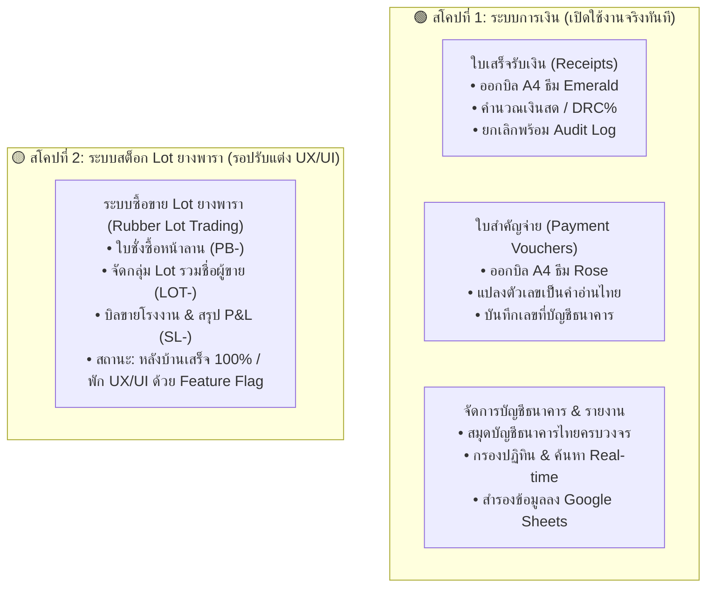

# 📄 Product Requirement Document (PRD) — Financial & Rubber Lot Management System

> **ชื่อโครงการ:** ระบบออกใบเสร็จรับเงิน ใบสำคัญจ่าย บันทึกบัญชี และระบบซื้อขาย Lot ยางพารา  
> **องค์กร:** บริษัท ศรีสุข พูนทรัพย์ ยางพารา จำกัด  
> **เวอร์ชันเอกสาร:** 5.1 (Enterprise Production & Staging Specification)  
> **วันที่อัปเดตล่าสุด:** 21 กันยายน 2569 (2026-09-21)  
> **สาขา Git:** `feature/backend-staging`  
> **สถานะโครงการ:** ระบบการเงิน (ใบเสร็จ/ใบสำคัญจ่าย) พร้อมใช้งาน 100% | ระบบสต็อกยางพารา (หลังบ้านเสร็จ 100%, รอปรับแต่ง UX/UI)

---

## 1. 🎯 วัตถุประสงค์และภาพรวมโครงการ (Project Overview & Business Goals)

ระบบเว็บแอปพลิเคชันบริหารจัดการเอกสารทางการเงิน การบัญชี และระบบซื้อขายยางพาราของ **บริษัท ศรีสุข พูนทรัพย์ ยางพารา จำกัด** พัฒนาขึ้นเพื่อทดแทนการทำงานด้วยเอกสารกระดาษ ขจัดความผิดพลาดในการคำนวณเงินสด/ส่วนลด/ค่าเปอร์เซ็นต์เนื้อยางแห้ง (DRC%) และยกระดับสู่สถาปัตยกรรมระดับองค์กร (Cloudflare Edge & Serverless Architecture) 

### เป้าหมายทางธุรกิจ (Business Objectives)
1. **ความถูกต้องแม่นยำ 100% ทางการเงิน:** คำนวณยอดเงินภาษี, หัก ณ ที่จ่าย, ส่วนลด, และ DRC% ถูกต้องระดับสตางค์ พร้อมฟังก์ชันแปลงตัวเลขเป็นคำอ่านภาษาไทยอัตโนมัติ
2. **ขจัดปัญหาเลขที่เอกสารชนกัน (Zero Sequence Collision):** มีระบบรันเลขเอกสารรายเดือน `YYMMXXXX` แบบ Atomic จากฝั่งเซิร์ฟเวอร์ ออกบิลพร้อมกันได้ไม่ซ้ำกัน
3. **ป้องกันการบันทึกเบิ้ลเวลาอินเทอร์เน็ตหน่วง (Anti-Duplicate Guarantee):** ป้องกันเงินรั่วไหลและการตัดสต็อกซ้ำด้วยเทคโนโลยี Idempotency Guard
4. **ความโปร่งใสและตรวจสอบได้ (Immutable Audit Trail):** ทุกการแก้ไขและยกเลิกเอกสารถูกบันทึกประวัติแบบบล็อกเชน (Cryptographic Hash Chaining)
5. **ความต่อเนื่องทางธุรกิจ (Business Continuity):** สำรองข้อมูลอัตโนมัติทุกวันขึ้น Cloudflare R2 พร้อมตรวจวัดสถานะระบบ (Health Check) แบบ Real-time

---

## 2. 🚦 กลยุทธ์การแบ่งระยะปล่อยระบบ (Phased Release Strategy)

เพื่อให้สอดคล้องกับความต้องการของผู้ใช้งาน ที่ต้องการเน้นใช้งานส่วนใบเสร็จรับเงินและใบสำคัญจ่ายก่อน ระบบจึงถูกแบ่งสโคปการทำงานออกเป็น 2 กลุ่มอย่างชัดเจน:



### สรุปสโคปตามนโยบายผู้ใช้งาน:
* **สโคปที่ 1 (Active Scope - พร้อมใช้งานทันที):** ระบบออกใบเสร็จรับเงิน, ใบสำคัญจ่าย, พิมพ์เอกสาร A4, จัดการบัญชีธนาคาร และซิงค์ Google Sheets — **ดีไซน์และ UX/UI ล็อค 100% ห้ามแก้ไขเด็ดขาด**
* **สโคปที่ 2 (Deferred Scope - พักไว้รอ UX/UI):** ระบบสต็อกและการซื้อขาย Lot ยางพารา — **ซ่อนเมนูไว้ด้วย Feature Flag (`enableRubberLotTrading: false`)** โดยระบบหลังบ้าน (Database, Sequence, API, Calculations) เสร็จสมบูรณ์ 100% แล้ว เมื่อพร้อมปรับปรุง UX/UI จึงจะเปิดสวิตช์ใช้งาน

---

## 3. 🏛️ โครงสร้างสถาปัตยกรรมระบบ (System Architecture)

ระบบทำงานบนสถาปัตยกรรม Cloudflare Edge Serverless ที่มีความเร็วสูงระดับ Global Low-Latency:

```
┌────────────────────────────────────────────────────────────────────────┐
│                        Frontend Layer (React 18 + Vite)                │
│  ├── ReceiptForm / ReceiptHistoryModal / PrintReceipt (A4 Emerald)    │
│  ├── VoucherForm / VoucherHistoryModal / PrintVoucher (A4 Rose)        │
│  ├── BankAccountManagement / SettingsModal / Feature Flag Toggle       │
│  └── [Feature Flag OFF] RubberLotTrading (5 Tabs: Dashboard, Buy, Mix, Sell, DRC) │
└───────────────────────────────────┬────────────────────────────────────┘
                                    │ (RESTful API + UTF-8 Body + Idempotency-Key)
                                    ▼
┌────────────────────────────────────────────────────────────────────────┐
│             Cloudflare Worker API Layer (backend-staging/)             │
│  ├── Dual-Stack Local Server (0.0.0.0 IPv4 & ::1 IPv6)                 │
│  ├── Atomic Sequence Engine (YYMMXXXX Generator)                       │
│  ├── Idempotency Guard (UUIDv4 Anti-duplicate Lock)                    │
│  ├── Immutable Audit Logger (SHA-256 Hash Chained Box)                 │
│  ├── Financial Document Service (Receipts & Vouchers CRUD)             │
│  ├── Rubber Trading Services (Purchase, Lot Grouping, Factory Sale)    │
│  ├── Automated Backup Engine (Daily Cron Trigger: 0 18 * * *)         │
│  └── System Health Observability Engine (/api/v1/system/health)        │
└───────────────────┬───────────────────────────────┬────────────────────┘
                    │                               │
           (SQLite D1 Binding)            (R2 Bucket Binding)
                    ▼                               ▼
┌──────────────────────────────────────┐  ┌──────────────────────────────┐
│  Cloudflare D1 Database (SQLite)     │  │ Cloudflare R2 Storage        │
│  - Single Source of Truth (SSOT)     │  │ - Automated Daily Snapshots  │
│  - 7 Core Tables + Strict Foreign Keys│ │ - SHA-256 Integrity Checksum │
│  - Normalized Schema (UTF-8 Thai)    │  │ - Pointer: backups/latest.json│
└───────────────────┬──────────────────┘  └──────────────────────────────┘
                    │ (ctx.waitUntil Background Worker)
                    ▼
┌──────────────────────────────────────┐
│  Google Sheets Database (Backup)     │
│  - Read-Only Analytical Backup       │
│  - Apps Script Webhook Replication   │
└──────────────────────────────────────┘
```

---

## 4. 📄 ข้อกำหนดฟังก์ชันระบบการเงิน (Financial Modules Specification — Active Scope)

### 4.1 ระบบออกใบเสร็จรับเงิน (Receipt Management)
* **รหัสเอกสาร:** รันเลขอัตโนมัติในรูปแบบ `YYMMXXXX` (เช่น `69090001` โดย 69 คือปี พ.ศ. 2569 และ 09 คือเดือนกันยายน) รีเซ็ตลำดับใหม่ทุกต้นเดือน
* **แบบฟอร์มการกรอก:**
  * ข้อมูลลูกค้า (ชื่อ, ที่อยู่, เลขประจำตัวผู้เสียภาษี 13 หลัก)
  * ช่องทางการชำระเงิน: เงินสด, เงินโอน, เช็ค
  * การเลือกบัญชีธนาคารปลายทาง (กรณีเลือกเงินโอน)
  * รายการสินค้า: ชื่อสินค้า, จำนวน, ราคาต่อหน่วย, เปอร์เซ็นต์ DRC%, ยอดรวมสุทธิ
  * ยอดส่วนลดท้ายบิล และหมายเหตุ
* **ฟังก์ชันการพิมพ์:** ออกแบบสำหรับกระดาษมาตรฐาน A4 ธีมสีเขียวมรกต (Emerald Green) มีต้นฉบับ/สำเนา ตราประทับ วันที่ และลายเซ็นผู้รับเงิน
* **การยกเลิกเอกสาร:** สามารถยกเลิกใบเสร็จได้โดยต้องระบุเหตุผลในการยกเลิก โดยระบบจะเก็บประวัติลง Audit Log และคงเลขที่เอกสารไว้เพื่อความถูกต้องตามหลักบัญชี

### 4.2 ระบบออกใบสำคัญจ่าย (Payment Voucher Management)
* **รหัสเอกสาร:** รันเลขอัตโนมัติในรูปแบบ `YYMMXXXX` (แยก Sequence อิสระจากใบเสร็จรับเงิน)
* **แบบฟอร์มการกรอก:**
  * ข้อมูลผู้รับเงิน (ชื่อ, ที่อยู่, เลขประจำตัวผู้เสียภาษี)
  * รายละเอียดค่าใช้จ่ายแบบ Multi-item (ระบุวันที่, รายการค่าใช้จ่าย, ยอดเงิน)
  * ข้อมูลการโอนเงิน (ธนาคารต้นทาง, ธนาคารปลายทาง, เลขที่บัญชี)
  * **แปลงตัวเลขเป็นคำอ่านภาษาไทยอัตโนมัติ:** เช่น `12,500.50` $\rightarrow$ *"หนึ่งหมื่นสองพันห้าร้อยบาทห้าสิบสตางค์"*
* **ฟังก์ชันการพิมพ์:** ออกแบบสำหรับกระดาษมาตรฐาน A4 ธีมสีแดงกุหลาบ (Rose Red) มีช่องสำหรับผู้จัดทำ, ผู้ตรวจสอบ, ผู้อนุมัติจ่าย, และผู้รับเงิน
* **การยกเลิกเอกสาร:** บันทึกเหตุผลการยกเลิกและเวลาที่ยกเลิกอย่างรัดกุม

### 4.3 ระบบจัดการบัญชีธนาคาร (Bank Account Management)
* จัดเก็บสมุดบัญชีธนาคารของบริษัท รองรับธนาคารพาณิชย์ชั้นนำของไทย (SCB, KBANK, BBL, KTB, BAY, TTB, GSB ฯลฯ)
* แสดงไอคอนและสีประจำธนาคารอย่างถูกต้อง
* กำหนดประเภทการใช้งานของแต่ละบัญชี (ใช้ทั่วไป หรือเฉพาะใบสำคัญจ่าย)

### 4.4 ระบบค้นหาและรายงานประวัติ (History & Search)
* กรองประวัติตามช่วงวันที่ (ปฏิทินไทย), สถานะเอกสาร (ปกติ / ยกเลิก), และคำค้นหา (ชื่อลูกค้า, เลขที่เอกสาร)
* ปุ่มสั่งพิมพ์ย้อนหลังได้ทันที

---

## 5. 🌿 ข้อกำหนดระบบซื้อขาย Lot ยางพารา (Rubber Lot Specification — Staging / Deferred Scope)

> ⚠️ **หมายเหตุ:** ระบบส่วนนี้พัฒนาฝั่ง Backend Engine และ Database เสร็จสมบูรณ์ 100% แล้ว ปัจจุบันพักการใช้งานฝั่งหน้าบ้านไว้ด้วย Feature Flag เพื่อรอปรับแต่ง UX/UI ให้ตรงตามความต้องการของผู้ใช้งานในอนาคต

### 5.1 การรับซื้อยางหน้าลาน (Inbound Purchasing)
* รหัสตั๋วชั่งซื้อ: `PB-YYMMXXXX` (เช่น `PB-69090001`)
* ฟิลด์ข้อมูล: เลขที่ใบชั่งกระดาษ (`paper_ref`), วันที่ซื้อ, ชื่อผู้ขาย, ชนิดยาง, น้ำหนักรวม (กก.), ราคาต่อหน่วย, ค่า DRC%, น้ำหนักแห้ง, และยอดเงินสุทธิ
* รองรับยาง 6 ประเภทมาตรฐาน: ยางก้อน (AA), ขี้ยาง (BB), ยางแผ่นดิบ (CC), ยางแผ่นรมควัน (DD), น้ำยางสด (EE), เศษยาง (FF)

### 5.2 การจัดกลุ่มและรวม Lot สินค้า (Lot Grouping & Metadata)
* รหัส Lot: `LOT-YYMMXXXX` (เช่น `LOT-69090001`)
* **ชื่อ Lot (`lot_name`):** รวมชื่อผู้ขายทั้งหมดใน Lot เข้าด้วยกันอัตโนมัติ เช่น *"กัน, สาลี, จากการ"*
* **วันที่จัด Lot (`lot_date`):** บันทึกวันที่จัดกลุ่ม Lot อย่างชัดเจน
* **Single Product Constraint:** บังคับ 1 Lot ต้องบรรจุยางชนิดเดียวกัน 100%
* **Weighted Average Cost:** คำนวณต้นทุนเฉลี่ยถ่วงน้ำหนักต่อ กก. แบบ Real-time
* วงจรสถานะ Lot: `OPEN` $\rightarrow$ `LOCKED` (ปิดผนึกพร้อมส่ง) $\rightarrow$ `SHIPPED` $\rightarrow$ `COMPLETED`

### 5.3 การส่งขายโรงงานและการปิดยอดแล็บ (Factory Sale & Lab Settlement)
* รหัสบิลขาย: `SL-YYMMXXXX` (เช่น `SL-69090001`)
* **วันที่ส่งขาย (`sale_date`):** บันทึกวันที่ส่งมอบโรงงาน
* **เลขอ้างอิง Lot (`ref_lot_no`):** ผูกโยงกับรหัส Lot สินค้าต้นทาง
* บันทึกผลชั่งจริงหน้าโรงงานและค่าแล็บ DRC% จากโรงงาน
* หักค่าปรับสิ่งเจือปน, ค่าขนส่ง, และค่าธรรมเนียมอื่นๆ
* คำนวณผลสรุปกำไร-ขาดทุนสุทธิ (Net Profit), กำไรต่อ กก. (Margin/kg), และน้ำหนักสูญเสียระหว่างทาง (Weight Shrinkage)

---

## 6. 📊 โครงสร้างฐานข้อมูล Cloudflare D1 (Database Schema)

ฐานข้อมูลประกอบด้วย 7 ตารางหลักที่ออกแบบตามหลัก Normalized Relational Database:

| ชื่อตาราง | หน้าที่และคำอธิบาย | คีย์หลัก / ดัชนีสำคัญ |
|:---|:---|:---|
| **`documents`** | จัดเก็บใบเสร็จรับเงินและใบสำคัญจ่าย (Header & Items ในตัว) | PK: `id`, UNIQUE: `document_no`, INDEX: `doc_type`, `doc_date` |
| **`document_sequences`** | ตัวนับเลขที่เอกสาร Atomic ป้องกันเลขซ้ำ | PK: (`doc_type`, `prefix`) |
| **`idempotency_keys`** | บันทึกกุญแจป้องกันการกดบันทึกซ้ำซ้อน | PK: `key` (UUIDv4), INDEX: `created_at` |
| **`audit_logs`** | บันทึกประวัติการเงินแบบกล่องดำ (Hash Chained) | PK: `id`, INDEX: `resource_type`, `resource_id` |
| **`rubber_purchases`** | บันทึกการชั่งซื้อยางหน้าลาน | PK: `id`, UNIQUE: `ticket_no`, FK: `lot_id` |
| **`rubber_lots`** | หัวตารางรวม Lot สินค้ายางพารา | PK: `id`, UNIQUE: `lot_no`, INDEX: `product_type` |
| **`rubber_sales`** | บันทึกการส่งขายโรงงานและผลกำไร-ขาดทุน | PK: `id`, UNIQUE: `sale_no`, FK: `lot_id`, INDEX: `ref_lot_no` |

---

## 7. 🛡️ เสถียรภาพ ความปลอดภัย และการสำรองข้อมูล (Reliability & Security)

### 7.1 Automated R2 Daily Backup
* **ตั้งเวลาสำรองอัตโนมัติ:** Cloudflare Cron Trigger `0 18 * * *` (ตรงกับเวลา 01:00 น. ในประเทศไทย)
* **การทำงาน:** สแนปช็อตข้อมูลครบทั้ง 7 ตาราง เข้ารหัสตรวจสอบความสมบูรณ์ด้วย SHA-256 Cryptographic Checksum
* **ที่จัดเก็บ:** บันทึกลง Cloudflare R2 Bucket ในโครงสร้าง `backups/YYYY-MM/backup-YYYY-MM-DD-xxxx.json` พร้อมอัปเดต pointer `backups/latest.json`
* **Local Emulation:** รองรับการสำรองข้อมูลในเครื่องผ่านโฟลเดอร์ `backend-staging/backups/` ทำงานได้แม้ไม่มีสัญญาณอินเทอร์เน็ต

### 7.2 ระบบเฝ้าระวังและตรวจสุขภาพ (System Health Diagnostics)
* Endpoint: `GET /api/v1/system/health`
* วัดค่าความหน่วงของฐานข้อมูล (Database Latency ในหน่วย ms)
* ตรวจสอบความพร้อมของ R2 Backup Bucket และ Google Sheets Webhook
* นับจำนวนเรคคอร์ดของเอกสารทางการเงินและตั๋วยางพาราทั้งหมดแบบ Real-time

---

## 8. 🧪 ตารางสรุปผลการทดสอบระบบ (Verification & Quality Assurance)

ระบบผ่านการทดสอบครอบคลุมทั้งส่วนการเงินและส่วนยางพารา รวมทั้งสิ้น **13 ชุดทดสอบ (300/300 ข้อ ผ่าน 100%)**:

| ลำดับ | ชุดทดสอบ (Test Suite) | จำนวนข้อ | ผลลัพธ์ | วัตถุประสงค์การตรวจสอบ |
|:---:|:---|:---:|:---:|:---|
| 1 | Sequence Engine (`verifySequence.js`) | 13 | ✅ ผ่าน 100% | เลขที่เอกสาร `YYMMXXXX` ไม่ซ้ำและไม่กระโดดข้าม |
| 2 | Idempotency Guard (`verifyIdempotency.js`) | 15 | ✅ ผ่าน 100% | ป้องกันการกดส่งข้อมูลซ้ำ ไม่สร้างบิลเบิ้ล |
| 3 | Immutable Audit Log (`verifyAuditLog.js`) | 20 | ✅ ผ่าน 100% | ตรวจจับการแก้ไขข้อมูลย้อนหลังด้วย Hash Chaining |
| 4 | Auth & RBAC (`verifyAuth.js`) | 23 | ✅ ผ่าน 100% | แฮชรหัสผ่าน PBKDF2 และควบคุมสิทธิ์ผู้ใช้ |
| 5 | Document CRUD (`verifyDocuments.js`) | 20 | ✅ ผ่าน 100% | ความถูกต้องของใบเสร็จและใบสำคัญจ่าย |
| 6 | Google Sheets Sync (`verifyGoogleSheetsSync.js`) | 16 | ✅ ผ่าน 100% | การสำรองข้อมูลลงชีตแบบเบื้องหลังไม่ค้างหน้าเว็บ |
| 7 | Staging Client (`verifyStagingClient.js`) | 8 | ✅ ผ่าน 100% | การเชื่อมต่อสลับโหมด Production/Staging |
| 8 | Rubber Purchases (`verifyRubberPurchases.js`) | 30 | ✅ ผ่าน 100% | คำนวณเงินสดและ DRC% ซื้อยางหน้าลาน |
| 9 | Rubber Lots (`verifyRubberLots.js`) | 32 | ✅ ผ่าน 100% | รวม Lot, ต้นทุนเฉลี่ยถ่วงน้ำหนัก, ล็อค Lot |
| 10 | Rubber Sales (`verifyRubberSales.js`) | 39 | ✅ ผ่าน 100% | คำนวณผลแล็บโรงงาน หักค่าขนส่ง สรุป P&L |
| 11 | Rubber HTTP & UI (`verifyRubberHttpRoutes.js`) | 40 | ✅ ผ่าน 100% | Endpoints API และการเชื่อมต่อหน้าเว็บ |
| 12 | Backup Service (`verifyBackupService.js`) | 23 | ✅ ผ่าน 100% | สแนปช็อต D1, SHA-256 Checksum, จัดเก็บ R2 |
| 13 | System Health (`verifySystemHealth.js`) | 21 | ✅ ผ่าน 100% | ตรวจสถานะระบบ, Latency, และ Cron Trigger |
| **รวม** | **รวมผลการทดสอบทั้งหมดของระบบ** | **300** | **✅ 100%** | **ผ่านครบทุกข้อ ไม่มีข้อผิดพลาด (0 Failed)** |

---

## 9. 🔒 กฎเหล็กข้อบังคับ: ล็อค UX/UI เดิม 100% (Strict UX/UI Lock Policy)

> ⚠️ **คำสั่งเด็ดขาดจากผู้ใช้ (User Constraint):**  
> **"ห้ามแก้ไขในส่วนของ UX/UI เพราะพึงพอใจแล้ว"**

1. **หน้าตาและดีไซน์เดิมของระบบการเงิน 100%:**
   - แบบฟอร์มใบเสร็จรับเงิน (`ReceiptForm`)
   - แบบฟอร์มใบสำคัญจ่าย (`VoucherForm`)
   - หน้าต่างประวัติและค้นหา (`HistoryModal`)
   - หน้าจัดการบัญชีธนาคาร (`BankAccountManagement`)
   - ฟอร์มพิมพ์ A4 ทั้งใบเสร็จและใบสำคัญจ่าย (`PrintReceipt`, `PrintVoucher`)
   - สี, ขนาดตัวอักษร, ระยะขอบ, และไอคอนทั้งหมด **ล็อคตายตัว 100% ไม่มีการดัดแปลง**
2. **ระบบใหม่แยกอิสระ:**
   - โมดูลยางพาราถูกแยกเก็บใน [`RubberLotTrading.jsx`](file:///Users/aukkdach/Library/Mobile%20Documents/com~apple~CloudDocs/Antigravity%20project/Receipt/src/components/RubberLotTrading.jsx) และควบคุมด้วยสวิตช์ในหน้า Settings
   - ผู้ใช้สามารถเปิดใช้งานเฉพาะระบบการเงินได้อย่างสบายใจ ปราศจากผลกระทบต่อระบบงานเดิม 100%

---
*เอกสาร PRD ฉบับสมบูรณ์ ได้รับการรับรองและอัปเดต ณ วันที่ 21 กันยายน 2569 (2026-09-21)*
