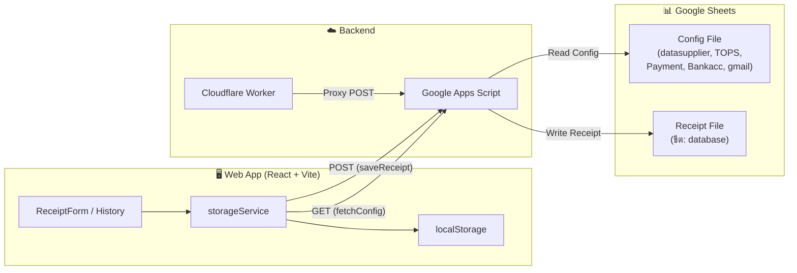
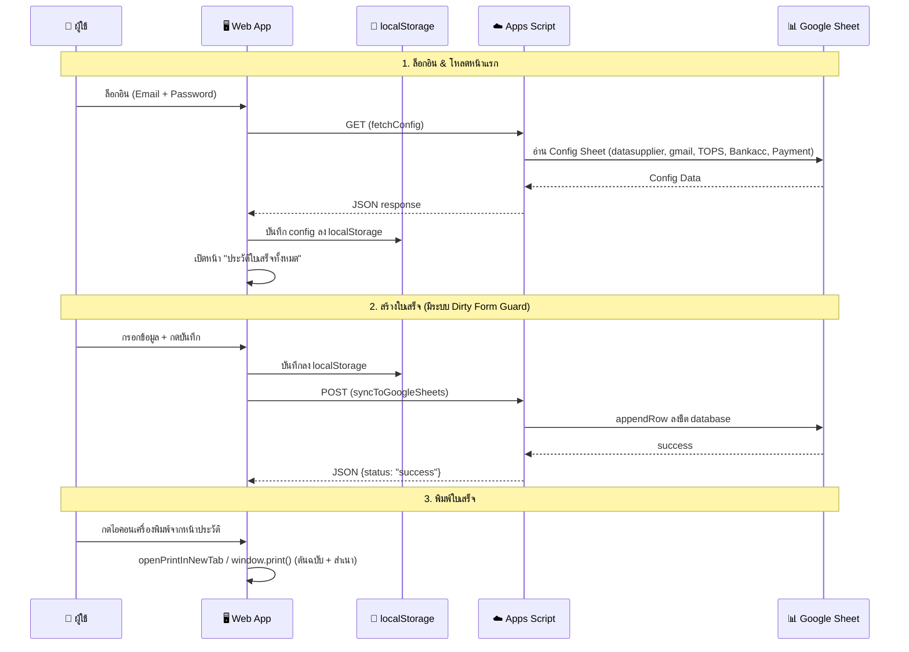

# 📋 PRD — ระบบออกใบเสร็จรับเงินออนไลน์ (Receipt Web App)

> **Project:** Receipt Web Application  
> **Owner:** บริษัท ศรีสุข พูนทรัพย์ ยางพารา จำกัด  
> **Version:** 1.5  
> **Last Updated:** 10/08/2569 (2026-08-10)

---

## 1. ภาพรวมโปรเจกต์ (Project Overview)

ระบบออกใบเสร็จรับเงินออนไลน์สำหรับธุรกิจรับซื้อยางพารา ออกแบบเพื่อทดแทนการออกใบเสร็จด้วยมือ โดยบันทึกข้อมูลลงบน Google Sheets เป็นฐานข้อมูลหลัก รองรับการพิมพ์ใบเสร็จรูปแบบ A4 (ต้นฉบับ + สำเนา) แปลงจำนวนเงินเป็นภาษาไทย (BAHTTEXT) อัตโนมัติ พร้อมระบบประวัติใบเสร็จ การป้องกันข้อมูลสูญหาย (Dirty Form Guard) และการจัดการสิทธิ์ผู้ใช้งาน (Role-Based Access Control)

---

## 2. Tech Stack

| Layer | Technology |
|---|---|
| **Frontend** | React 18, Vite 5, TailwindCSS 3.4, Lucide React Icons |
| **Backend / API** | Google Apps Script (Code.gs) |
| **CORS Proxy** | Cloudflare Worker |
| **Database** | Google Sheets (2 ไฟล์: Config & Receipt Database) |
| **Local Cache** | Browser `localStorage` (Offline-first) |
| **Print** | CSS Print Media + `window.print()` / New Tab Print |

---

## 3. สถาปัตยกรรมระบบ (Architecture)



---

## 4. Google Sheets Database

### 4.1 Config File (ไฟล์ตั้งค่า)
- **Sheet ID:** `1FiWYtzhqsO_7TJ222INNWI8QsgXVJ7lWv83S3bfY7qM`

| ชีต | คอลัมน์ | รายละเอียด |
|---|---|---|
| `datasupplier` | A: ชื่อ, B: ที่อยู่, C: เลขผู้เสียภาษี | รายชื่อผู้ขาย (Supplier) |
| `TOPS` | A: ประเภทสินค้า, B: Short Code | ประเภทยาง (AA:ยางก้อน, BB:ขี้ยาง ฯลฯ) |
| `Payment` | A: ประเภทการชำระ | เงินโอน, เช็ค, เงินสด |
| `Bankacc` | A: ชื่อธนาคาร, B: เลขบัญชี | บัญชีธนาคาร |
| `gmail` | A: อีเมล/Gmail, B: รหัสผ่าน, C: ชื่อผู้ใช้, D: สิทธิ์ (Admin/User), E: สถานะ (Active/Pending/Blocked) | ผู้ใช้งานระบบ |

### 4.2 Receipt Log File (ไฟล์บันทึกใบเสร็จ)
- **Sheet ID:** `1YE4F8WjWT13R_aMOYVmR2NuhaA6FE8ua1cKsdMlttwk`
- **ชีต:** `database`

| คอลัมน์ | ข้อมูล |
|---|---|
| A | วันที่ |
| B | เลขที่ใบเสร็จ |
| C | นามผู้ซื้อ |
| D | ที่อยู่ |
| E | เลขประจำตัวผู้เสียภาษี |
| F | งวด |
| G | รายการสินค้าหรือบริการ |
| H | จำนวน |
| I | ราคาต่อหน่วย |
| J | DRC(%) |
| K | จำนวนเงิน |
| L | ชำระโดย |
| M | วันที่โอน/สั่งจ่าย |
| N | หมายเหตุ |
| O | ผู้รับเงิน |
| P | สถานะ |
| Q | สาเหตุที่ยกเลิก |
| R | วันที่พิมพ์/บันทึก |

---

## 5. โครงสร้างไฟล์โปรเจกต์ (Project Structure)

```
Receipt/
├── index.html
├── package.json
├── prd.md                          # เอกสาร PRD ฉบับสมบูรณ์ (v1.5)
├── progress.md                     # บันทึกความก้าวหน้าและการแก้ไขล่าสุด (v1.5)
├── vite.config.js
├── tailwind.config.js
├── postcss.config.js
├── src/
│   ├── main.jsx                    # Entry point
│   ├── App.jsx                     # Root component + Navigation + Dirty Form Guard
│   ├── App.css                     # Global styles
│   ├── index.css                   # Tailwind base
│   ├── components/
│   │   ├── ReceiptForm.jsx         # ฟอร์มสร้าง/ดูรายละเอียดใบเสร็จ (Fit Screen Layout)
│   │   ├── PrintReceipt.jsx        # เทมเพลตพิมพ์ A4 (ต้นฉบับ + สำเนา)
│   │   ├── AddItemModal.jsx        # Modal เพิ่ม/แก้ไขรายการสินค้า
│   │   ├── SearchableSelect.jsx    # Dropdown ค้นหาได้ (Supplier, Bank, Period)
│   │   ├── Sidebar.jsx             # เมนูด้านซ้าย Accordion + Role-based scoping
│   │   ├── AuthModal.jsx           # หน้าล็อกอินด้วย อีเมล + รหัสผ่าน
│   │   ├── ReceiptHistoryModal.jsx # หน้าประวัติใบเสร็จทั้งหมด (Full page flex scroll)
│   │   ├── UserManagementModal.jsx # หน้าจัดการผู้ใช้งานระบบ (Admin only)
│   │   └── SettingsModal.jsx       # ตั้งค่าเชื่อมต่อ Google Sheet (Admin only)
│   ├── services/
│   │   └── storageService.js       # Data service, Auth & Google Sheet sync
│   ├── utils/
│   │   ├── bahttext.js             # แปลงตัวเลขเงินเป็นภาษาไทย
│   │   └── dateUtils.js            # จัดการวันที่ พ.ศ. และ ISO
│   └── test/
│       └── verifyLogic.test.js     # Unit tests
├── google-apps-script/
│   └── Code.gs                     # Backend API (Google Apps Script)
├── cloudflare-worker/
│   ├── index.js                    # CORS Proxy Worker
│   └── wrangler.toml               # Cloudflare config
└── dist/                           # Production build output
```

---

## 6. ฟีเจอร์หลัก (Core Features)

### 6.1 🔐 ระบบยืนยันตัวตนและการจัดการสิทธิ์ (Authentication & RBAC)
- เข้าสู่ระบบด้วย **อีเมล และ รหัสผ่าน** (หรือ Gmail Account)
- ตรวจสอบสิทธิ์ผู้ใช้ (Role: `Admin` / `User`) และสถานะ (`Active` / `Pending` / `Blocked`) จาก Google Sheet แบบ Real-time
- **สิทธิ์ User ทั่วไป:** เข้าถึงได้เฉพาะเมนู **"ใบเสร็จ"** (สร้างใบเสร็จ และ ดูประวัติใบเสร็จ) โดยระบบจะซ่อนหมวด "จัดการระบบ" ออกทั้งหมด
- **สิทธิ์ Admin:** เข้าถึงได้ทุกเมนู รวมทั้งเมนู **"จัดการผู้ใช้งานระบบ"** และ **"ตั้งค่า Google Sheet"**

### 6.2 📜 การเปิดหน้าจอเริ่มต้นหลังล็อกอิน (Login Landing Page)
- เมื่อล็อกอินเข้าสู่ระบบสำเร็จ ระบบจะนำผู้ใช้ไปยังหน้า **"ประวัติใบเสร็จรับเงินทั้งหมด"** เป็นหน้าหลักเสมอ

### 6.3 🚨 ระบบป้องกันข้อมูลใบเสร็จสูญหาย (Dirty Form Navigation Guard)
- เมื่อผู้ใช้อยู่ในหน้าสร้างใบเสร็จ และมีการกรอกข้อมูลค้างไว้ (ชื่อผู้ซื้อ, รายการสินค้า, หมายเหตุ ฯลฯ)
- หากพยายามสลับหน้าไปหน้าอื่น หรือกดสร้างใหม่ หรือกดออกจากระบบ **Popup แจ้งเตือนสีส้มจะเด้งขึ้นทันที**:
  - **[ ทำรายการต่อ ]**: ปิด Popup และอยู่หน้าเดิมต่อเพื่อกรอก/บันทึกใบเสร็จ
  - **[ ยืนยันละทิ้งข้อมูล ]**: ละทิ้งข้อมูลเดิมที่ไม่ได้รับบันทึก แล้วเปิดไปยังหน้าเป้าหมายตามที่ต้องการ
- หากฟอร์มว่างเปล่า, บันทึกแล้ว, หรืออยู่ในโหมดดูรายละเอียดแบบ Read-only จะไม่แสดง Popup รบกวน

### 6.4 📜 การล็อกการเลื่อนทั้งหน้า (Lock Page Scroll & Fit Items Table Scroll)
- ตัวหน้าเว็บทั้งหมด (Header, การกรอกข้อมูลผู้ซื้อ, การชำระเงิน) จะ **ล็อกอยู่กับที่บนหน้าจอ (No Page Scroll)**
- Scrollbar จะมีเลื่อนได้เฉพาะ **ภายในกรอบตารางรายการสินค้า (SECTION 2: รายการรายรับ)** เท่านั้น เมื่อมีรายการสินค้าเป็นจำนวนมาก

### 6.5 📝 สร้างใบเสร็จรับเงิน (Receipt Creation)
- **เลขที่ใบเสร็จ:** Auto-generate รูปแบบ `YYMMXXXX` (เช่น `69080001`)
- **นามผู้ซื้อ:** Searchable dropdown ดึงจาก Google Sheet (datasupplier) พร้อม Auto-fill ที่อยู่ + เลขผู้เสียภาษี
- **งวด:** Dropdown เลือก เดือน/ปี พ.ศ. (เช่น `08/2569`) หรือพิมพ์เองได้
- **รายการสินค้า:** รองรับหลายรายการต่อใบเสร็จ (Multi-item) พร้อม DRC%, คำนวณราคารวมอัตโนมัติ
- **ข้อมูลการชำระ:** เงินโอน / เช็ค / เงินสด (กรณีเลือกเงินโอนหรือเช็ค จะต้องเลือกบัญชีธนาคารหรือระบุเลขที่เช็คเป็นข้อมูลสำคัญ)
- **ล็อคหลังบันทึก:** บันทึกได้ 1 ครั้งต่อ 1 ใบเสร็จ ป้องกันการแก้ไขหลังบันทึก

### 6.6 👁️ ระบบดูรายละเอียดใบเสร็จย้อนหลัง (Read-Only Detail View)
- คลิกที่ **เลขที่ใบเสร็จ** ในหน้าประวัติเพื่อเปิดดูรายละเอียดในฟอร์ม
- ฟอร์มจะแสดงข้อมูลทั้งหมดในโหมด **Read-only (อ่านได้อย่างเดียว)** ไม่สามารถแก้ไขได้
- หัวข้อหน้าจอแสดงเป็น `รายละเอียดใบเสร็จ (เลขที่ใบเสร็จ)`
- ปุ่ม **"พิมพ์"** ในหน้าดูรายละเอียดจะถูกล็อกไว้ (Disabled) ป้องกันการพิมพ์จากหน้านี้
- เมื่อกดปุ่ม **"สร้างใหม่"** ระบบจะล้างข้อมูลและรีเซ็ตกลับเป็นหน้าฟอร์มสร้างใบเสร็จฉบับใหม่

### 6.7 🖨️ พิมพ์ใบเสร็จ (Print Receipt)
- รูปแบบ A4 มาตรฐาน ฟอนต์ **TH Sarabun New**
- พิมพ์ 2 ฉบับอัตโนมัติ: **ต้นฉบับ** + **สำเนา** (มี page-break แยก)
- แสดงจำนวนเงินเป็นตัวอักษรภาษาไทย (BAHTTEXT)
- **ช่องทางพิมพ์ย้อนหลัง:** พิมพ์ย้อนหลังได้เฉพาะการกด **ไอคอนเครื่องพิมพ์ (Printer)** ในตารางหน้าประวัติเท่านั้น

### 6.8 📊 ประวัติใบเสร็จ (Receipt History)
- แสดงแบบเต็มหน้า (Full-page View) พร้อม Flex Scroll ที่เลื่อนดูรายการประวัติย้อนหลังได้อย่างลื่นไหล
- ค้นหาใบเสร็จด้วย เลขที่ใบเสร็จ / นามผู้ซื้อ / รายการสินค้า / ผู้รับเงิน
- แสดงวันที่บันทึก (Date) และ Time Stamp
- สามารถยกเลิกใบเสร็จพร้อมระบุสาเหตุ (อัปเดตสถานะใน Google Sheet แบบ Real-time)

---

## 7. Data Flow — ขั้นตอนการทำงาน



---

## 8. Receipt Number Format

| ส่วน | รูปแบบ | ตัวอย่าง |
|---|---|---|
| ปี พ.ศ. (2 หลัก) | `YY` | `69` |
| เดือน (2 หลัก) | `MM` | `08` |
| ลำดับ (4 หลัก) | `XXXX` | `0001` |
| **รวม** | **`YYMMXXXX`** | **`69080001`** |

---

## 9. สรุปสถานะระบบ (Current System Status)

- **ความสมบูรณ์ของโค้ด:** 100% (ผ่านการทดสอบ Build บน Vite และ Logic Test)
- **ไฟล์ PRD & Progress:** อัปเดตล่าสุดเป็นเวอร์ชัน 1.5
- **ความเรียบร้อย:** พร้อมใช้งานจริงสำหรับผู้ใช้งานทั่วไปและ Admin
