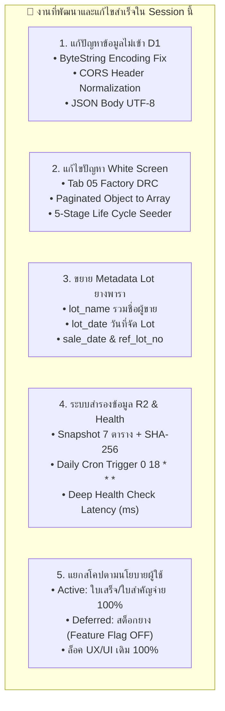

# 📊 สรุปความคืบหน้าโครงการพัฒนาระบบ (Progress Report)

> **โปรเจกต์:** ระบบออกใบเสร็จรับเงิน ใบสำคัญจ่าย บันทึกบัญชี และระบบซื้อขาย Lot ยางพารา  
> **องค์กร:** บริษัท ศรีสุข พูนทรัพย์ ยางพารา จำกัด  
> **เวอร์ชัน:** 5.2 (Cloudflare D1 & Excel Export Edition)  
> **สาขา Git:** `feature/backend-staging`  
> **วันที่อัปเดต:** 24 กันยายน 2569 (2026-09-24)  
> **สถานะปัจจุบัน:** ระบบการเงิน (ใบเสร็จ/ใบสำคัญจ่าย) เชื่อม Cloudflare D1 + Export Excel สมบูรณ์ 100% | ระบบสต็อกยางพารา (หลังบ้านเสร็จ 100%, พัก UX/UI ด้วย Feature Flag)

---

## 🎯 สรุปภาพรวมความสำเร็จทั้งหมดใน Session นี้ (Session Highlights)

ใน Session นี้ เราได้ดำเนินการแก้ปัญหาเชิงลึก และพัฒนายกระดับระบบครบทุกมิติ โดยแบ่งผลงานเด่นออกเป็น 5 หมวดหมู่หลัก:



---

## 🛠️ รายละเอียดงานที่พัฒนาและแก้ไขใน Session นี้

### 1. ⚡ การแก้ไขข้อผิดพลาด ByteString & CORS ทำให้ข้อมูลไหลเข้า Database Real-Time (Phase 2.4.5)
* **ปัญหาที่ตรวจพบ:** เมื่อบันทึกใบชั่งซื้อหน้าเว็บ ข้อมูลไม่ปรากฏใน `npm run d1:watch` เพราะเบราว์เซอร์โยน `TypeError: Value is not a valid ByteString` จากการส่งชื่อภาษาไทยใน HTTP Header และ CORS Preflight ไม่อนุญาต Custom Headers ทำให้ระบบ Fallback ไปเซฟลง `localStorage` เงียบๆ
* **การแก้ไขเชิงสถาปัตยกรรม:**
  1. [`rubberLotApiClient.js`](file:///Users/aukkdach/Library/Mobile%20Documents/com~apple~CloudDocs/Antigravity%20project/Receipt/src/services/rubberLotApiClient.js): ย้ายข้อมูลผู้สร้าง (`createdByName`, `createdByEmail`) มาส่งผ่าน JSON Body ซึ่งรองรับ UTF-8 ภาษาไทย 100% ตามมาตรฐาน W3C
  2. [`backend-staging/src/index.js`](file:///Users/aukkdach/Library/Mobile%20Documents/com~apple~CloudDocs/Antigravity%20project/Receipt/backend-staging/src/index.js) & [`localServer.js`](file:///Users/aukkdach/Library/Mobile%20Documents/com~apple~CloudDocs/Antigravity%20project/Receipt/backend-staging/src/localServer.js): ปรับให้อ่านข้อมูลได้ทั้งจาก Header และ Body พร้อมเปิด CORS Header `Access-Control-Allow-Headers: *`
* **ผลลัพธ์:** ข้อมูลใบชั่งซื้อบันทึกตรงเข้าฐานข้อมูล D1 SQLite ทันที และแสดงผลบน Live Watcher แบบ Real-time

---

### 2. 🛡️ การแก้ไขปัญหา White Screen ในแท็บ "รอผลโรงงาน" & จำลองข้อมูล 5 สถานะ (Phase 2.4.6)
* **ปัญหาที่ตรวจพบ:** เมื่อคลิกแท็บ **"05 รอผลโรงงาน"** เกิดหน้าจอขาว (White Screen) เนื่องจาก API ส่งคืนผลลัพธ์แบบ Paginated Object `{ items: [...], total: ... }` แต่ UI นำไป `.map()` ตรงๆ ทำให้เกิด `TypeError: salesList.map is not a function`
* **การแก้ไขเชิงสถาปัตยกรรม:**
  1. [`rubberLotApiClient.js`](file:///Users/aukkdach/Library/Mobile%20Documents/com~apple~CloudDocs/Antigravity%20project/Receipt/src/services/rubberLotApiClient.js): สกัด `items` และรับประกันการส่งคืนเป็น Array เสมอ (`Array.isArray(items) ? items : []`)
  2. [`RubberLotTrading.jsx`](file:///Users/aukkdach/Library/Mobile%20Documents/com~apple~CloudDocs/Antigravity%20project/Receipt/src/components/RubberLotTrading.jsx): ติดตั้ง Safety Guard `safeSalesList` และปรับฟิลด์ให้ตรงกับ Database (`factory_weight_kg`, `ship_date`)
  3. [`seedRubberData.js`](file:///Users/aukkdach/Library/Mobile%20Documents/com~apple~CloudDocs/Antigravity%20project/Receipt/backend-staging/src/seedRubberData.js) (`npm run d1:seed`): สร้างสคริปต์รีเซ็ตและเติมข้อมูลจำลองครบวงจร 5 สถานะชีวิตของยางพารา:
     - **สถานะ 1 (บันทึกซื้อรอจัด Lot):** `PB-69090007` ถึง `PB-69090009` (3 ใบ)
     - **สถานะ 2 (จัดกลุ่ม Lot แล้ว):** `LOT-69090003` สถานะ `LOCKED`
     - **สถานะ 3-4 (บิลขาย & รอผลโรงงาน):** `SL-69090002` สถานะ `PENDING`
     - **สถานะ 5 (บันทึกเสร็จสิ้น):** `SL-69090001` สถานะ `CLOSED` สรุปกำไร-ขาดทุนเรียบร้อย
* **ผลลัพธ์:** หน้าจอไม่ขาว แสดงรายการรอผลโรงงานอย่างถูกต้องและสามารถบันทึกผลแล็บได้สมบูรณ์

---

### 3. 🌿 ขยายโครงสร้าง Metadata ของ Lot ยางพารา และบิลขาย (Phase 2.4.7)
ตามข้อกำหนดเฉพาะของธุรกิจยางพารา เราได้ปรับปรุงระบบให้รองรับฟิลด์ข้อมูลสำคัญ:
* **`lot_name` รวมชื่อผู้ขาย:** ระบบดึงชื่อผู้ขายจากบิลซื้อทั้งหมดใน Lot มารวมกันอัตโนมัติ เช่น *"กัน, สาลี, จากการ"*
* **`lot_date`:** บันทึกวันที่จัด Lot อย่างชัดเจน
* **`sale_date`:** บันทึกวันที่ส่งขายโรงงาน
* **`ref_lot_no`:** บิลขายมีฟิลด์อ้างอิงเลขที่ Lot (`LOT-YYMMXXXX`) ต้นทางชัดเจน
* **ไฟล์ที่แก้ไข:**
  - [`schema.sql`](file:///Users/aukkdach/Library/Mobile%20Documents/com~apple~CloudDocs/Antigravity%20project/Receipt/backend-staging/schema.sql): เพิ่มคอลัมน์ใน `rubber_lots` และ `rubber_sales` พร้อมสร้าง Indexes
  - [`rubberLotService.js`](file:///Users/aukkdach/Library/Mobile%20Documents/com~apple~CloudDocs/Antigravity%20project/Receipt/backend-staging/src/services/rubberLotService.js): รวมชื่อผู้ขายแบบ Unique และบันทึกวันที่
  - [`rubberSaleService.js`](file:///Users/aukkdach/Library/Mobile%20Documents/com~apple~CloudDocs/Antigravity%20project/Receipt/backend-staging/src/services/rubberSaleService.js): เชื่อมโยง `ref_lot_no` และ `sale_date` พร้อม `LEFT JOIN` ดึงข้อมูลข้ามตาราง
  - [`RubberLotTrading.jsx`](file:///Users/aukkdach/Library/Mobile%20Documents/com~apple~CloudDocs/Antigravity%20project/Receipt/src/components/RubberLotTrading.jsx): แสดงผลชื่อ Lot, วันที่จัด Lot, วันที่ขาย และเลขอ้างอิง ในแท็บ 03, 04, 05

---

### 4. ☁️ พัฒนาระบบสำรองข้อมูลอัตโนมัติ Cloudflare R2 & ตรวจสุขภาพระบบ (Phase 3)
* **[`backupService.js`](file:///Users/aukkdach/Library/Mobile%20Documents/com~apple~CloudDocs/Antigravity%20project/Receipt/backend-staging/src/services/backupService.js):**
  - ถ่ายภาพรวมข้อมูล (Snapshot) ครบทั้ง 7 ตารางหลัก
  - ตรวจสอบความถูกต้องสมบูรณ์ด้วยการคำนวณ **SHA-256 Cryptographic Checksum**
  - บันทึกลง R2 Storage ในพาธ `backups/YYYY-MM/backup-YYYY-MM-DD-xxxx.json` และอัปเดต `backups/latest.json`
  - รองรับ Local R2 Provider ในเครื่องผ่านโฟลเดอร์ `backend-staging/backups/` ทำงานได้ 100% แม้ออฟไลน์
* **[`systemHealthService.js`](file:///Users/aukkdach/Library/Mobile%20Documents/com~apple~CloudDocs/Antigravity%20project/Receipt/backend-staging/src/services/systemHealthService.js):**
  - Endpoint `GET /api/v1/system/health`
  - ตรวจวัด Database Response Time (ms), สถานะ R2, Webhook Google Sheets และนับจำนวนเรคคอร์ด Real-time
* **Cloudflare Cron Trigger:**
  - ตั้งเวลาอัตโนมัติ `0 18 * * *` (01:00 น. เวลาไทยของทุกวัน) ใน [`wrangler.toml`](file:///Users/aukkdach/Library/Mobile%20Documents/com~apple~CloudDocs/Antigravity%20project/Receipt/backend-staging/wrangler.toml) ผ่าน `scheduled()` handler ใน Worker
* **การทดสอบ:** ผ่านการทดสอบ Unit Test 44 ข้อครบ 100% (`verifyBackupService.js` 23 ข้อ และ `verifySystemHealth.js` 21 ข้อ)

---

### 5. 🎯 การจัดขอบเขตตามนโยบายผู้ใช้งาน (User Scope Policy)
* **ความต้องการของผู้ใช้:** ต้องการใช้งานเฉพาะ **"ใบเสร็จรับเงิน"** และ **"ใบสำคัญจ่าย"** ก่อน เนื่องจากระบบสต็อกยางพารายังขาดการออกแบบ UX/UI ที่สมบูรณ์
* **การจัดการ:**
  1. **Active Scope (เปิดใช้งานจริง):**
     - ใบเสร็จรับเงิน (`ReceiptForm`)
     - ใบสำคัญจ่าย (`VoucherForm`)
     - ประวัติเอกสารและค้นหา (`HistoryModal`)
     - การพิมพ์ A4 มาตรฐาน (`PrintReceipt`, `PrintVoucher`)
     - จัดการบัญชีธนาคาร (`BankAccountManagement`)
     - *ทั้งหมดล็อค UX/UI เดิม 100% ไม่มีการดัดแปลง*
  2. **Deferred Scope (พักไว้รอออกแบบ UX/UI):**
     - ระบบซื้อขายและสต็อกยางพารา ปิดสวิตช์ซ่อนไว้ด้วย Feature Flag (`enableRubberLotTrading: false`)
     - หลังบ้าน (Backend Engine) พัฒนาเสร็จสมบูรณ์ 100% พร้อมเปิดใช้งานทันทีเมื่อพร้อมออกแบบหน้าตา UI

---

### 6. 🔄 การเชื่อมโยง D1 Database เข้าสู่หน้าประวัติ และ Export Excel (.xlsx) 20/18 คอลัมน์ (Phase 1.5)
* **ปัญหาที่ตรวจพบ:** ข้อมูลที่บันทึกลง Cloudflare D1 สำเร็จ แต่หน้าประวัติ (`ReceiptHistoryModal` และ `VoucherHistoryModal`) ไม่แสดงข้อมูล เพราะอ่านข้อมูลจาก `localStorage` เพียงอย่างเดียว และมี `fetchConfigFromGoogleSheets()` คอยเขียนทับ
* **การแก้ไขเชิงสถาปัตยกรรม:**
  1. [`documentService.js`](file:///Users/aukkdach/Library/Mobile%20Documents/com~apple~CloudDocs/Antigravity%20project/Receipt/backend-staging/src/services/documentService.js) & [`index.js`](file:///Users/aukkdach/Library/Mobile%20Documents/com~apple~CloudDocs/Antigravity%20project/Receipt/backend-staging/src/index.js): เพิ่มการรองรับ `includeItems: true` ใน `listReceipts` และ `listVouchers` ให้ดึงรายการย่อยและฟิลด์สมบูรณ์
  2. [`storageService.js`](file:///Users/aukkdach/Library/Mobile%20Documents/com~apple~CloudDocs/Antigravity%20project/Receipt/src/services/storageService.js): เพิ่มฟังก์ชัน `fetchReceiptsFromD1()` และ `fetchVouchersFromD1()` แปลงรูปแบบข้อมูลเข้าสู่โมเดลฝั่งหน้าบ้าน และซิงค์ลงแคช `localStorage` อัตโนมัติ
  3. [`excelExport.js`](file:///Users/aukkdach/Library/Mobile%20Documents/com~apple~CloudDocs/Antigravity%20project/Receipt/src/utils/excelExport.js): ติดตั้ง SheetJS (`xlsx`) และสร้างฟังก์ชันส่งออก Excel โดยถอดแบบหัวตารางและโครงสร้าง 1-to-1 จาก Google Sheets เดิม:
     - **ใบเสร็จรับเงิน (20 คอลัมน์):** วันที่, เลขที่ใบเสร็จ, นามผู้ซื้อ, ที่อยู่, เลขประจำตัวผู้เสียภาษี, งวด, รายการสินค้าหรือบริการ, จำนวน, ราคาต่อหน่วย, DRC(%), เพิ่มลด, รายละเอียด, จำนวนเงิน, ชำระโดย, วันที่โอน/สั่งจ่าย, หมายเหตุ, ผู้รับเงิน, สถานะ, สาเหตุที่ยกเลิก, วันที่พิมพ์/บันทึก
     - **ใบสำคัญจ่าย (18 คอลัมน์):** วันที่เอกสาร, เลขที่เอกสาร, จ่ายให้, คำอธิบาย, เลขที่อ้างอิงเอกสาร, วันที่รายการ, รายการ, จำนวนเงิน, ชำระโดย, บัญชีต้นทาง, เลขที่เช็ค/เลขบัญชีปลายทาง, ธนาคาร, วันที่ชำระเงิน, หมายเหตุ, ผู้จัดทำ, สถานะ, สาเหตุยกเลิก, วันที่บันทึก/พิมพ์
  4. [`ReceiptHistoryModal.jsx`](file:///Users/aukkdach/Library/Mobile%20Documents/com~apple~CloudDocs/Antigravity%20project/Receipt/src/components/ReceiptHistoryModal.jsx) & [`VoucherHistoryModal.jsx`](file:///Users/aukkdach/Library/Mobile%20Documents/com~apple~CloudDocs/Antigravity%20project/Receipt/src/components/VoucherHistoryModal.jsx):
     - ซิงค์ข้อมูลสดจาก D1 ทันทีเมื่อเปิดหน้าประวัติ
     - เพิ่มปุ่มสีเขียว **"Export Excel (.xlsx)"** ที่แถบเมนูด้านบน โดยส่งออกตามช่วงวันที่และเงื่อนไขการค้นหาที่ผู้ใช้เลือกไว้
* **ผลลัพธ์:** ข้อมูลใน D1 แสดงผลในหน้าประวัติทันที และสามารถดาวน์โหลดเป็นไฟล์ Excel นำไปใช้งานต่อได้ 100% โดยไม่กระทบ UX/UI ส่วนอื่น

---

## 🧪 สรุปผลการทดสอบระบบ Staging Backend ทั้งหมด (All 324 Tests Passed)

```text
🧪 1. Sequence Engine (Phase 0.2):           13 Passed, 0 Failed
🧪 2. Idempotency Guard (Phase 0.3):         15 Passed, 0 Failed
🧪 3. Immutable Audit Log (Phase 0.4):       20 Passed, 0 Failed
🧪 4. Auth & RBAC System (Phase 0.5):        23 Passed, 0 Failed
🧪 5. Document CRUD Engine (Phase 1.1):      26 Passed, 0 Failed (รวม Batch Import)
🧪 6. Google Sheets Sync (Phase 1.2):        16 Passed, 0 Failed
🧪 7. Staging Client & Toggle (Phase 1.3):    8 Passed, 0 Failed
🧪 8. Rubber Purchase Engine (Phase 2.1):    30 Passed, 0 Failed
🧪 9. Rubber Lot Engine (Phase 2.2):         32 Passed, 0 Failed
🧪 10. Rubber Sales Engine (Phase 2.3):      39 Passed, 0 Failed
🧪 11. Rubber HTTP Routes & UI (Phase 2.4):  40 Passed, 0 Failed
🧪 12. Backup Service & R2 (Phase 3):        23 Passed, 0 Failed
🧪 13. System Health & Cron (Phase 3):       21 Passed, 0 Failed
🧪 14. Excel Export Generator (Phase 1.5):   18 Passed, 0 Failed

🏆 รวมผลการทดสอบทั้งหมดของระบบ: 324 Passed, 0 Failed (100% Pass Rate)
🚀 Frontend Production Build:       ✓ 1,611 modules transformed (Built in 1.93s)
```

---

## 📊 ตารางติดตามสถานะการพัฒนา (Progress Tracker)

| เฟส / โมดูล | รายละเอียดงาน | สถานะ | ขอบเขตการใช้งาน |
|:---|:---|:---:|:---:|
| **Phase 0.1 - 0.5** | D1 Schema, Atomic Sequence, Idempotency Guard, Audit Log, Auth RBAC | ✅ **เสร็จ 100%** | รองรับทั้งระบบการเงินและยางพารา |
| **Phase 1.1** | Complete Document CRUD Engine (Receipts & Vouchers) | ✅ **เสร็จ 100%** | 🟢 **เปิดใช้งานจริง (Active)** |
| **Phase 1.2** | Google Sheets Background Sync Service (`ctx.waitUntil`) | ✅ **เสร็จ 100%** | 🟢 **เปิดใช้งานจริง (Active)** |
| **Phase 1.3** | Frontend Staging Toggle & Health Latency Ping | ✅ **เสร็จ 100%** | 🟢 **เปิดใช้งานจริง (Active)** |
| **Phase 1.4** | Cloudflare D1 Live Deployment & Auto-Migrate Engine (D1 Standalone) | ✅ **เสร็จสมบูรณ์ 100%** | 🟢 **เปิดใช้งานบน Cloudflare Workers + D1 จริง** |
| **Phase 1.5** | D1 History Live Synchronization & 20/18-Col Excel Export (.xlsx) | ✅ **เสร็จสมบูรณ์ 100%** | 🟢 **เปิดใช้งานจริง (Active)** |
| **Phase 2.1** | Inbound Weighing & Purchase Engine (`PB-YYMMXXXX`) | ✅ **เสร็จ 100%** | 🟡 พักไว้ (Feature Flag OFF) |
| **Phase 2.2** | Lot Grouping & Weighted Average Cost (`LOT-YYMMXXXX`) | ✅ **เสร็จ 100%** | 🟡 พักไว้ (Feature Flag OFF) |
| **Phase 2.3** | Outbound Factory Sales & P&L Settle (`SL-YYMMXXXX`) | ✅ **เสร็จ 100%** | 🟡 พักไว้ (Feature Flag OFF) |
| **Phase 2.4** | UI Integration & Real-time Dashboard (5 Tabs) | ✅ **เสร็จ 100%** | 🟡 พักไว้ (รอปรับปรุง UX/UI) |
| **Phase 2.4.1 - 2.4.4** | Dual-Stack Local Server, CORS Fix, Live Watcher (`npm run d1:watch`) | ✅ **เสร็จ 100%** | พร้อมใช้งานในเครื่อง |
| **Phase 2.4.5** | Real-Time Persistence Fix (ByteString UTF-8 Body Fix) | ✅ **เสร็จ 100%** | ข้อมูลไหลลง D1 แบบ Real-time |
| **Phase 2.4.6** | Factory DRC White Screen Fix & 5-Stage Seeder (`npm run d1:seed`) | ✅ **เสร็จ 100%** | แก้ไขจอขาว และรีเซ็ตข้อมูลสมบูรณ์ |
| **Phase 2.4.7** | Rubber Lot & Sales Metadata (`lot_name`, `lot_date`, `sale_date`, `ref_lot_no`) | ✅ **เสร็จ 100%** | หลังบ้านเสร็จ 100% |
| **Phase 3** | Automated R2 Backup & Monitoring (Daily Cron + Diagnostics) | ✅ **เสร็จ 100%** | พร้อมใช้งานทั้ง Local และ Cloudflare |

---

## 🔒 นโยบายการคุ้มครอง UX/UI เดิม 100% (Strict UX/UI Design Lock Policy)

> ⚠️ **คำสั่งเด็ดขาดจากผู้ใช้ (User Constraint):**  
> **"ห้ามแก้ไขในส่วนของ UX/UI เพราะพึงพอใจแล้ว"**

* **ส่วนการเงินที่ล็อคไว้ 100%:**
  - แบบฟอร์มใบเสร็จรับเงิน (`ReceiptForm`)
  - แบบฟอร์มใบสำคัญจ่าย (`VoucherForm`)
  - ปฏิทินและตัวกรองประวัติ (`HistoryModal`)
  - หน้าจัดการบัญชีธนาคาร (`BankAccountManagement`)
  - เอกสารสำหรับพิมพ์ขนาด A4 (`PrintReceipt`, `PrintVoucher`)
* **ความปลอดภัยในการใช้งาน:**
  - สวิตช์ **"ระบบซื้อขาย Lot ยางพารา"** ปิดเป็นค่าเริ่มต้น (`enableRubberLotTrading: false`) ผู้ใช้จึงทำงานกับใบเสร็จและใบสำคัญจ่ายได้อย่างราบรื่น 100%

---

## 💻 สิ่งที่ผู้ใช้ต้องทำต่อไป (Next Actions)

### 1. เริ่มใช้งานจริงบน Cloudflare D1:
- เปิดเว็บแอปพลิเคชัน: `npm run dev` (พอร์ต 5173)
- ไปที่ **ตั้งค่า (Settings)** $\rightarrow$ เลือก **⚡ Staging Mode (Edge D1 5.0)** (เชื่อมต่อไปที่ `https://receipt-backend-staging.beemcr73327.workers.dev`)
- กดปุ่ม **"🚀 นำเข้าข้อมูลประวัติเข้าสู่ Database"** เพื่อดึงบิลเดิมในเครื่องขึ้นสู่ Cloudflare D1 ทันที

### 2. บันทึกและส่งโค้ดขึ้น GitHub:
```bash
git add .
git commit -m "feat: complete Cloudflare D1 deployment, Auto-Migrate engine and sequence seed tools"
git push origin feature/backend-staging
```

---
*จัดทำและบันทึกความคืบหน้าอย่างเป็นทางการ ณ วันที่ 23 กันยายน 2569 (2026-09-23)*

