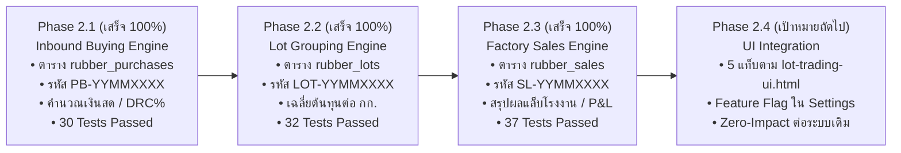

# 📊 สรุปความคืบหน้าโครงการพัฒนาระบบ (Progress Report)

> **โปรเจกต์:** ระบบออกใบเสร็จรับเงิน ใบสำคัญจ่าย บันทึกบัญชี และระบบซื้อขาย Lot ยางพารา  
> **องค์กร:** บริษัท ศรีสุข พูนทรัพย์ ยางพารา จำกัด  
> **เวอร์ชัน:** 5.0 (Phase 2 Enterprise Staging)  
> **สาขา Git:** `feature/backend-staging`  
> **วันที่อัปเดต:** 15 กันยายน 2569 (2026-09-15)

---

## 🎯 สรุปภาพรวมความสำเร็จใน Session นี้ (Session Highlights)

ใน Session นี้ เราได้ดำเนินการพัฒนา **Phase 2: ระบบซื้อขายและจัดการ Lot ยางพารา (Rubber Lot Trading & P&L Analytics System)** ต่อเนื่องอย่างเป็นระบบ โดยผ่านขั้นตอนการวิเคราะห์เชิงลึก (`/grill-me`), การออกแบบฐานข้อมูล Cloudflare D1, การสร้างโมดูลคำนวณเงิน, และการทดสอบด้วย Unit Test ครบ 100%:



---

## 🛠️ รายละเอียดงานที่พัฒนาเสร็จสมบูรณ์ใน Session นี้

### 1. 🌿 พัฒนาระบบรับซื้อยางหน้าลาน Inbound Weighing & Purchase Engine (Phase 2.1)
* **[`schema.sql`](file:///Users/aukkdach/Library/Mobile%20Documents/com~apple~CloudDocs/Antigravity%20project/Receipt/backend-staging/schema.sql):**
  * เพิ่ม 3 ตารางใหม่สำหรับระบบ Lot ยางพารา: `rubber_lots`, `rubber_purchases`, `rubber_sales` (ภาษาอังกฤษล้วน พร้อม Indexes ครบถ้วน)
* **[`sequenceService.js`](file:///Users/aukkdach/Library/Mobile%20Documents/com~apple~CloudDocs/Antigravity%20project/Receipt/backend-staging/src/services/sequenceService.js):**
  * ขยายระบบ Atomic Sequence Engine รองรับเอกสาร Lot ยางพารา:
    * ใบชั่งซื้อหน้าลาน: `PB-YYMMXXXX` (เช่น `PB-69090001`)
    * หัว Lot ยางพารา: `LOT-YYMMXXXX` (เช่น `LOT-69090001`)
    * บิลขายโรงงาน: `SL-YYMMXXXX` (เช่น `SL-69090001`)
  * คงความเข้ากันได้ 100% กับใบเสร็จรับเงินและใบสำคัญจ่ายเดิม
* **[`rubberPurchaseService.js`](file:///Users/aukkdach/Library/Mobile%20Documents/com~apple~CloudDocs/Antigravity%20project/Receipt/backend-staging/src/services/rubberPurchaseService.js):**
  * คำนวณสูตรน้ำหนักเนื้อยางแห้งและยอดเงินสุทธิ ทั้งแบบมีค่า DRC% (`Weight * Price * DRC% / 100`) และแบบซื้อสดไม่มี DRC (`Weight * Price`)
  * ฟังก์ชันสร้างใบชั่งซื้อ (`createPurchaseTicket`) พร้อมเลขที่อ้างอิงใบชั่งกระดาษ (`paper_ref`)
  * ฟังก์ชันดึงรายการซื้อที่รอจัดเข้า Lot (`getUnassignedPurchases`)
  * ฟังก์ชันยกเลิกใบชั่งซื้อ (`cancelPurchaseTicket`) พร้อมระบบความปลอดภัย: ป้องกันการยกเลิกบิลที่ถูกจัดเข้า Lot แล้ว
* **[`verifyRubberPurchases.js`](file:///Users/aukkdach/Library/Mobile%20Documents/com~apple~CloudDocs/Antigravity%20project/Receipt/backend-staging/src/test/verifyRubberPurchases.js):**
  * ชุดทดสอบ Unit Test 30 ข้อ ผ่านครบ 30/30 ข้อ 100%

---

### 2. 📦 พัฒนาระบบจัดกลุ่มและคำนวณต้นทุนเฉลี่ย Lot ยางพารา (Phase 2.2)
* **[`rubberLotService.js`](file:///Users/aukkdach/Library/Mobile%20Documents/com~apple~CloudDocs/Antigravity%20project/Receipt/backend-staging/src/services/rubberLotService.js):**
  * **Lot Grouping Engine:** รวมบิลชั่งซื้อ (`PB-...`) เข้าเป็น Lot สินค้าใหม่ ออกรหัส `LOT-YYMMXXXX` อัตโนมัติ
  * **Single Product Constraint:** บังคับ 1 Lot ต้องบรรจุยางชนิดเดียวกัน 100% ห้ามผสมข้ามประเภทเด็ดขาด
  * **Weighted Average Cost:** คำนวณน้ำหนักซื้อรวม ($\sum \text{weight}$), ต้นทุนซื้อรวม ($\sum \text{amount}$), และต้นทุนเฉลี่ยต่อ กก. ($\text{ต้นทุนรวม} / \text{น้ำหนักรวม}$) แบบ Real-time
  * **Dynamic Modification:** รองรับการเพิ่มบิลเข้า Lot (`addTicketsToLot`) และปลดบิลออกจาก Lot (`removeTicketFromLot`) ในขณะที่สถานะเป็น `OPEN` พร้อมคำนวณยอดผลรวมใหม่ทันที
  * **Lifecycle & Lock Control:** ระบบล็อค Lot เพื่อเตรียมจัดส่ง (`lockLot`: `OPEN` $\rightarrow$ `LOCKED`) และปลดล็อค (`unlockLot`)
  * **Safe Cancellation:** ระบบยกเลิก Lot (`cancelLot`) พร้อมปลดบิลชั่งซื้อทั้งหมดคืนสู่คลัง (`UNASSIGNED`) ป้องกันข้อมูลสูญหาย
* **[`verifyRubberLots.js`](file:///Users/aukkdach/Library/Mobile%20Documents/com~apple~CloudDocs/Antigravity%20project/Receipt/backend-staging/src/test/verifyRubberLots.js):**
  * ชุดทดสอบ Unit Test 32 ข้อ ผ่านครบ 32/32 ข้อ 100%

---

### 3. 🏭 พัฒนาระบบส่งขายโรงงานและสรุปผลกำไร-ขาดทุน (Phase 2.3)
* **[`rubberSaleService.js`](file:///Users/aukkdach/Library/Mobile%20Documents/com~apple~CloudDocs/Antigravity%20project/Receipt/backend-staging/src/services/rubberSaleService.js):**
  * **Dispatch & Sale Record (`createSaleRecord`):** ส่งออก Lot ที่ปิดผนึกแล้ว (`LOCKED`) ไปยังโรงงานปลายทาง ออกรหัสบิลส่งขาย **`SL-YYMMXXXX`** อัตโนมัติ (สถานะ `PENDING`) และปรับสถานะ Lot เป็น `SHIPPED`
  * **Factory Lab DRC Settlement (`settleFactoryResult`):** บันทึกผลชั่งจริงหน้าโรงงานและค่าแล็บ DRC% พร้อมหักค่าปรับสิ่งเจือปน ค่าขนส่ง และค่าธรรมเนียม
  * **Real-time Net Profit & Margin:** คำนวณรายรับสุทธิ (Net Revenue), ผลกำไร-ขาดทุนสุทธิ (Net Profit), กำไรต่อ กก. (Margin/kg), และน้ำหนักสูญเสียระหว่างทาง (Shrinkage) อัตโนมัติ ป้องกัน Floating-point precision error ด้วย `Number.EPSILON`
  * **State Transition & Lock:** เมื่อปิดยอดแล้ว สถานะบิลขายจะเป็น `CLOSED` และ Lot จะเปลี่ยนเป็น `COMPLETED`
  * **Safe Sale Cancellation:** ระบบยกเลิกบิลขาย (`cancelSaleRecord`) และคืนสถานะ Lot กลับเป็น `LOCKED` เพื่อเตรียมส่งขายใหม่ได้อย่างปลอดภัย
* **[`verifyRubberSales.js`](file:///Users/aukkdach/Library/Mobile%20Documents/com~apple~CloudDocs/Antigravity%20project/Receipt/backend-staging/src/test/verifyRubberSales.js):**
  * ชุดทดสอบ Unit Test 37 ข้อ ผ่านครบ 37/37 ข้อ 100%

---

## 🧪 สรุปผลการทดสอบระบบ Staging Backend ทั้งหมด (All Tests Passed)

```text
🧪 1. Sequence Engine (Phase 0.2):         13 Passed, 0 Failed
🧪 2. Idempotency Guard (Phase 0.3):       15 Passed, 0 Failed
🧪 3. Immutable Audit Log (Phase 0.4):     20 Passed, 0 Failed
🧪 4. Auth & RBAC System (Phase 0.5):      23 Passed, 0 Failed
🧪 5. Document CRUD Engine (Phase 1.1):    20 Passed, 0 Failed
🧪 6. Google Sheets Sync (Phase 1.2):      16 Passed, 0 Failed
🧪 7. Staging Client & Toggle (Phase 1.3):  8 Passed, 0 Failed
🧪 8. Rubber Purchase Engine (Phase 2.1):  30 Passed, 0 Failed
🧪 9. Rubber Lot Engine (Phase 2.2):       32 Passed, 0 Failed
🧪 10. Rubber Sales Engine (Phase 2.3):    37 Passed, 0 Failed

🏆 รวมผลการทดสอบทั้งหมดของระบบ: 214 Passed, 0 Failed (100% Pass Rate)
🚀 Frontend Production Build:       ✓ 1,607 modules transformed (Built in 1.68s)
```

---

## 💡 ความหมายทางธุรกิจของผลการทดสอบ (Business Significance)

| ชุดทดสอบ | จำนวน | ความหมายในการดำเนินธุรกิจของ บริษัท ศรีสุข พูนทรัพย์ ยางพารา จำกัด |
|:---|:---:|:---|
| **Sequence Engine** | 13 ข้อ | การันตีเลขที่บิล `PB-`, `LOT-`, `SL-` ไม่ซ้ำและไม่กระโดดข้าม แม้ออกบิลพร้อมกัน |
| **Idempotency Guard** | 15 ข้อ | ป้องกันการกดบันทึกเบิ้ลเวลาเน็ตช้า ไม่จ่ายเงินซ้ำ ไม่ตัดสต็อกซ้ำ |
| **Immutable Audit Log** | 20 ข้อ | บันทึกประวัติแบบบล็อกเชน ป้องกันการแอบแก้ราคายางหรือยอดเงินย้อนหลัง |
| **Auth & RBAC** | 23 ข้อ | ระบบความปลอดภัย ป้องกันพนักงานทั่วไปแอบดูตัวเลขกำไรของบริษัท |
| **Document CRUD** | 20 ข้อ | ความแม่นยำของใบเสร็จและใบสำคัญจ่ายเดิม รวมถึงการคำนวณส่วนลด |
| **Google Sheets Sync** | 16 ข้อ | ส่งข้อมูลไปสำรองลง Google Sheets แบบเบื้องหลัง หน้าเว็บไม่ค้าง |
| **Staging Toggle** | 8 ข้อ | สวิตช์แยกห้องทดลอง ทำให้การพัฒนาระบบ Lot ปลอดภัยต่อระบบเดิม 100% |
| **Rubber Purchases (2.1)** | 30 ข้อ | คำนวณเงินสด/DRC ซื้อยางหน้าลานแม่นยำระดับสตางค์ ป้องกันเงินรั่วไหล |
| **Rubber Lots (2.2)** | 32 ข้อ | คุมคุณภาพยาง 1 Lot ชนิดเดียวกัน 100% และคำนวณต้นทุนเฉลี่ยถ่วงน้ำหนัก |
| **Rubber Sales & P&L (2.3)** | 37 ข้อ | คำนวณเงินโอนโรงงานตามผลแล็บจริง หักค่าขนส่ง/ค่าปรับ สรุปกำไรต่อ กก. |

---

## 🛡️ ผลการตรวจสอบความปลอดภัยของระบบ Production (Verification)

| ส่วนประกอบระบบ | สถานะการตรวจสอบ | ผลลัพธ์ |
|:---|:---:|:---|
| **Frontend Production Mode** | ค่าเริ่มต้น Default เป็น Production 100% | ✅ ปลอดภัย ผู้ใช้หน้าเว็บทำงานได้ตามปกติ |
| **Production Worker (`cloudflare-worker/`)** | ไม่มีการแตะต้อง 100% | ✅ ปลอดภัย API เดิมทำงานได้ตามปกติ |
| **Google Apps Script Backend** | ไม่มีการแตะต้อง 100% | ✅ ปลอดภัย ซิงค์ข้อมูลลงชีตได้ตามปกติ |
| **Google Sheets Database** | ไม่มีการแตะต้อง 100% | ✅ ปลอดภัย ข้อมูลจริงไม่ได้รับผลกระทบ |

---

## 📊 ตารางติดตามสถานะการพัฒนา (Progress Tracker)

| เฟส / โมดูล | รายละเอียดงาน | สถานะ | แผนดำเนินการ |
|:---|:---|:---:|:---|
| **Phase 0.1** | D1 Database Schema Design & Migration บน Cloudflare D1 Studio | ✅ **เสร็จสมบูรณ์ 100%** | ฐานข้อมูล Staging พร้อมใช้งานบน Cloudflare |
| **Phase 0.2** | Atomic Sequence Engine (ระบบรันเลขเอกสาร `YYMMXXXX` และ Manual Seed) | ✅ **เสร็จสมบูรณ์ 100%** | ผ่าน Unit Test 13/13 ข้อ |
| **Phase 0.3** | Idempotency Guard (ระบบป้องกันการกดสร้างเอกสารซ้ำด้วย UUID) | ✅ **เสร็จสมบูรณ์ 100%** | ผ่าน Unit Test 15/15 ข้อ |
| **Phase 0.4** | Immutable Audit Logging (ระบบบันทึกประวัติแบบ Insert-Only + Hash Chaining) | ✅ **เสร็จสมบูรณ์ 100%** | ผ่าน Unit Test 20/20 ข้อ |
| **Phase 0.5** | JWT Authentication & RBAC (แฮชรหัสผ่าน PBKDF2 และระบบสิทธิ์ผู้ใช้) | ✅ **เสร็จสมบูรณ์ 100%** | ผ่าน Unit Test 23/23 ข้อ |
| **Phase 1.1** | Complete Document CRUD Engine (Receipts & Vouchers + DRC Calculation) | ✅ **เสร็จสมบูรณ์ 100%** | ผ่าน Unit Test 20/20 ข้อ |
| **Phase 1.2** | Google Sheets Background Sync Service (Replication ผ่าน `ctx.waitUntil`) | ✅ **เสร็จสมบูรณ์ 100%** | ผ่าน Unit Test 16/16 ข้อ |
| **Phase 1.3** | Frontend Migration / Toggle (สวิตช์หน้าบ้านเชื่อมต่อ Staging Backend API) | ✅ **เสร็จสมบูรณ์ 100%** | ผ่าน Unit Test 8/8 ข้อ + Vite Build ผ่าน |
| **Phase 2.1** | Inbound Weighing & Purchase Engine (ระบบชั่งซื้อยางหน้าลาน PB-YYMMXXXX) | ✅ **เสร็จสมบูรณ์ 100%** | ผ่าน Unit Test 30/30 ข้อ |
| **Phase 2.2** | Lot Grouping Engine (ระบบรวมบิลซื้อเข้า Lot สินค้า LOT-YYMMXXXX) | ✅ **เสร็จสมบูรณ์ 100%** | ผ่าน Unit Test 32/32 ข้อ |
| **Phase 2.3** | Outbound Factory Sales Engine (ระบบบิลส่งขายโรงงาน SL-YYMMXXXX) | ✅ **เสร็จสมบูรณ์ 100%** | ผ่าน Unit Test 37/37 ข้อ |
| **Phase 2.4** | Real-time P&L Analytics & React UI Integration | ⏳ **เป้าหมายถัดไป** | เริ่มพัฒนา Phase 2.4 |
| **Phase 3** | Automated R2 Backup & Monitoring (Sentry / Cloudflare Logpush) | ⏳ รอดำเนินการ | หลังจบ Phase 2 |

---

## 🔒 กฎเหล็กข้อบังคับ: ล็อค UX/UI 100% (Strict UX/UI Design Lock Policy)

> ⚠️ **คำสั่งเด็ดขาดจากผู้ใช้ (User Constraint):**  
> **"ห้ามแก้ไขในส่วนของ UX/UI เพราะพึงพอใจแล้ว"**

* **ขอบเขตการล็อค:**
  1. **หน้าตาและดีไซน์เดิม 100%:** หน้าใบเสร็จรับเงิน (`ReceiptForm`), หน้าใบสำคัญจ่าย (`VoucherForm`), ปฏิทินตัวกรองประวัติ (`HistoryModal`), แบบฟอร์มพิมพ์ A4 (`PrintReceipt`, `PrintVoucher`), หน้าจัดการบัญชีธนาคาร (`BankAccountManagement`), เมนูแถบข้าง (`Sidebar`), ฟอนต์, สี, และขนาดตัวอักษร **ล็อคตายตัว 100% ไม่มีการแตะต้อง**
  2. **ระบบใหม่ใน Phase 2.4:** จัดทำเป็นโมดูลแยกต่างหาก และถูกควบคุมด้วยสวิตช์ **Feature Flag** ในหน้า Settings (Default: ปิด) ผู้ใช้จึงสามารถเปิด-ปิดทดสอบได้อย่างปลอดภัยสูงสุด

---

## 📦 รายการ Commit ที่เตรียมไว้ในเครื่องบน Branch `feature/backend-staging`

1. `432e130`: `feat(phase-2.1): inbound rubber purchasing engine, schema tables & verification tests`
2. `bc14f2e`: `feat(phase-2.2): rubber lot grouping, weighted average cost & aggregation engine`
3. `6ca8ffb`: `feat(phase-2.3): factory sales engine, lab drc settlement & real-time pnl analytics`

### 💻 คำสั่งสำหรับ Push ขึ้น GitHub:
```bash
git push origin feature/backend-staging
```

---
*จัดทำและบันทึกความคืบหน้าอย่างเป็นทางการ ณ วันที่ 15 กันยายน 2569 (2026-09-15)*
